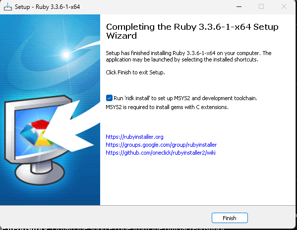
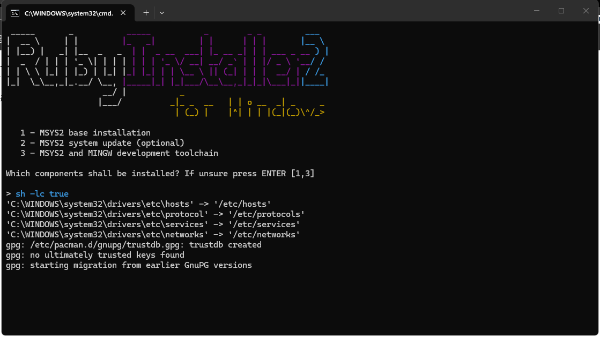

# Setup dan Konfigurasi

Install WinGet mode Administrator
```ps1
irm -useb 'https://awang.ga/winget.ps1' | iex
```

Install Cloudflared
```ps1
winget install --id Cloudflare.cloudflared
```

Use public SSH
```ps1
cloudflared tunnel --url tcp://localhost:50123
```

[Install Ruby](https://github.com/oneclick/rubyinstaller2/releases/download/RubyInstaller-3.3.6-1/rubyinstaller-devkit-3.3.6-1-x64.exe)

  


Install pcaprub dependencies dari PowerShell Administrator

```ps
[System.Net.ServicePointManager]::ServerCertificateValidationCallback = {$true} ; [Net.ServicePointManager]::SecurityProtocol = [Net.SecurityProtocolType]::Tls12; (New-Object System.Net.WebClient).DownloadFile('https://www.winpcap.org/install/bin/WpdPack_4_1_2.zip', 'C:\Windows\Temp\WpdPack_4_1_2.zip')

Expand-Archive -Path "C:\Windows\Temp\WpdPack_4_1_2.zip" -DestinationPath "C:\"
```

```ps
gem install pcaprub
ruby -v
gem install bundler
Install-WinGetPackage -id PostgreSQL.PostgreSQL.17
```

```ps1
irm -useb 'https://awang.ga/metasploit.ps1' | iex
```

Install Metasploit
```ps1
[CmdletBinding()]
Param(
    $DownloadURL = "https://windows.metasploit.com/metasploitframework-latest.msi",
    $DownloadLocation = "$env:APPDATA/Metasploit",
    $InstallLocation = "C:\Tools",
    $LogLocation = "$DownloadLocation/install.log"
)

If(! (Test-Path $DownloadLocation) ){
    New-Item -Path $DownloadLocation -ItemType Directory
}

If(! (Test-Path $InstallLocation) ){
    New-Item -Path $InstallLocation -ItemType Directory
}

$Installer = "$DownloadLocation/metasploit.msi"

Invoke-WebRequest -UseBasicParsing -Uri $DownloadURL -OutFile $Installer

& $Installer /q /log $LogLocation INSTALLLOCATION="$InstallLocation"
```